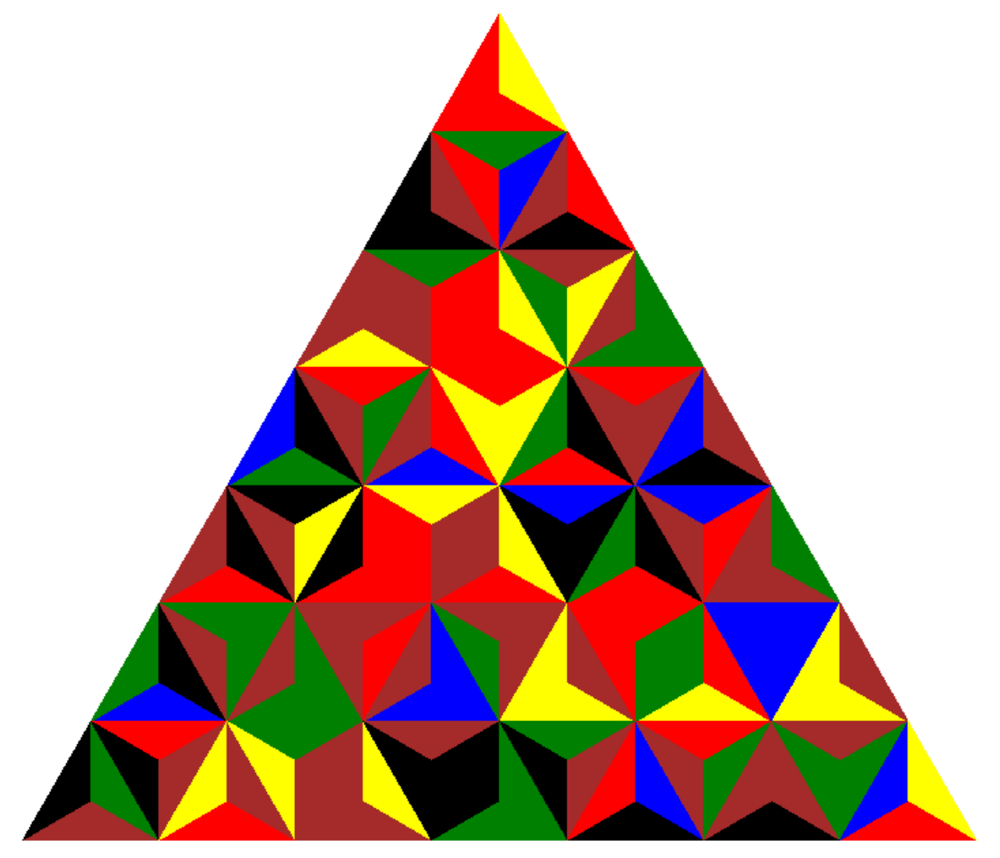
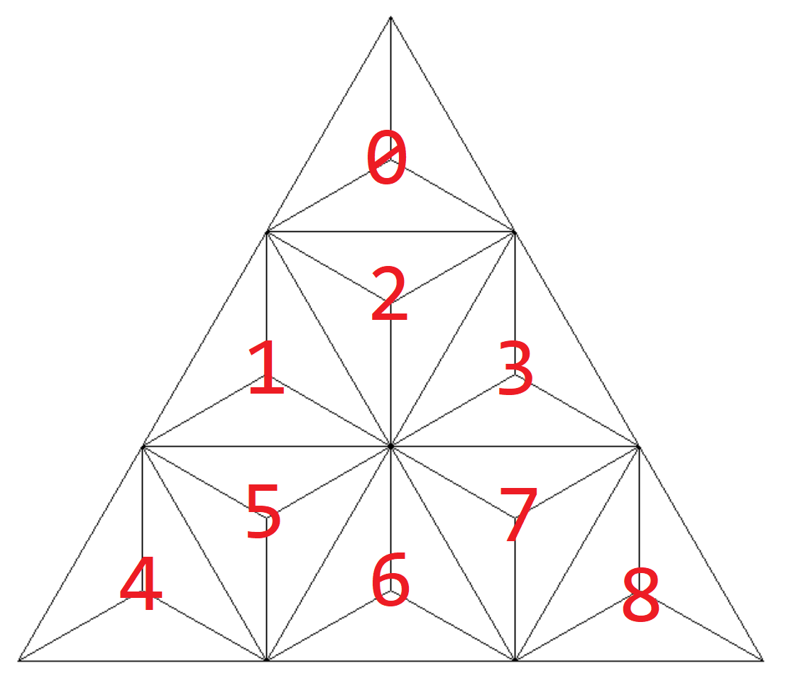
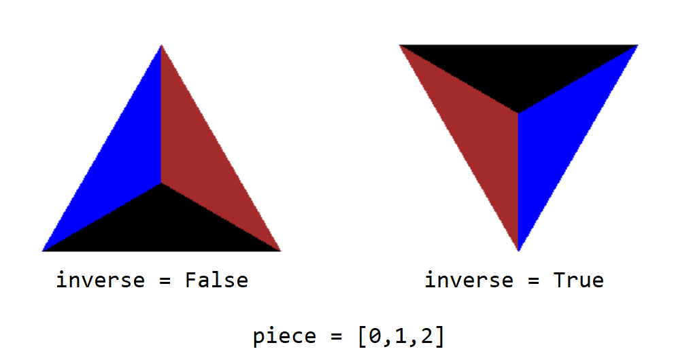

# PuzzleDraw: Triangular Edge-Matching Puzzle Drawer as part of the Final Project for COEN 6321/432 course by Prof. Nawwaf Kharma
The script `drawPuzzle.py` reads puzzle pieces from a csv file and draws the puzzle using `turtle` (yes I know.. turtle is verryyyy old! but it is fun)

The puzzle is generated using: </a> <a href="https://coen6321puzzelegen.appspot.com">https://coen6321puzzelegen.appspot.com</a> and stored in a csv file.
## Example file
puzzle.csv has an example puzzle of size 7 the following is the drawing generated:

<p align="center">
  
</p>

## Order of Drawing
The script loads the pieces from the csv file and appends a list `pieces`. 
The order in pieces will be drawn as seen in the image below, where the number on the piece represents the index of the piece in the list.
<p align="center">
  
</p>

## Order of Colors
Each piece is represented by an array of size 3. The order of the colors is based on the order of the numbers representing colors in the array. 
Index 0: color of the bottom triangle
Index 1: color of the left triangle
Index 2: color of the right triangle

If the triangle is drawn in inverse, the same color ordering is used before inverting the triangle. Then the triangle is rotated. 
The image below shows an example of the same triangle with colors
```
[0,1,2] = [black, blue, brown]
```
<p align="center">
  
</p>

## Modifying the Script
If you have a different file formating for your puzzle, you can modify the script as needed. 
I would suggest you organize the pieces in the same order needed for the drawing functions to work instead of modifying the drawing.
For example, if in your file you have 2 other columns for order of piece and orientation of the triangle, then after loading all the pieces you can sort the pieces based on order and order the colors based on the orientation to match the order used in the script.

## Side Note
This script was just written for fun! If you don't want to use it.. you don't have to.
